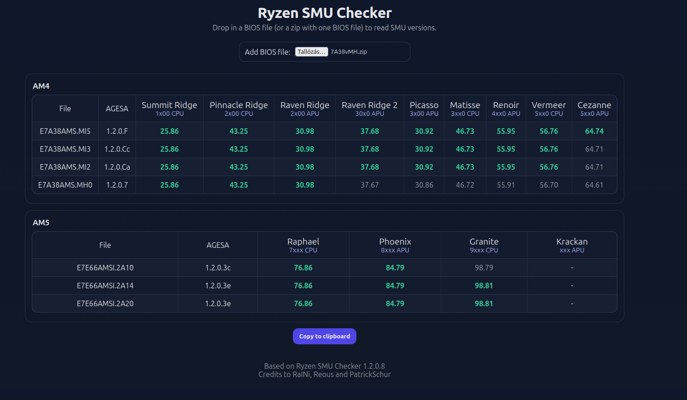

# Ryzen SMU Checker

Small in-browser tool to read and compare AGESA + SMU versions from AMD Ryzen BIOS files (AM4 and AM5).

https://kolos.github.io/ryzen-smu-checker/

## Screenshot

## Features

- Reads AGESA version (when present in the BIOS image)
- Detects socket type (AM4 vs AM5) and keeps results separated
- Optimized scanning: only searches the patterns for the detected socket
- Supports loading a BIOS directly or from a `.zip` (zip must contain exactly one BIOS payload)
- Shows unzip/read progress (ZIP decompression is usually the slowest step)
- Highlights the highest SMU version per CPU family
- One-click export: copies Markdown tables to clipboard for easy sharing

## Usage

1. Open the website.
2. Click “Add BIOS file” and select a BIOS file (or a `.zip` containing one BIOS file).
3. The AM4/AM5 section appears only when files of that socket are loaded.
4. Use “Copy to clipboard” to export the comparison table.

## Notes

- Runs fully in your browser; BIOS files are not uploaded anywhere.
- The ZIP filter intentionally ignores common non-BIOS extras (docs/scripts).

